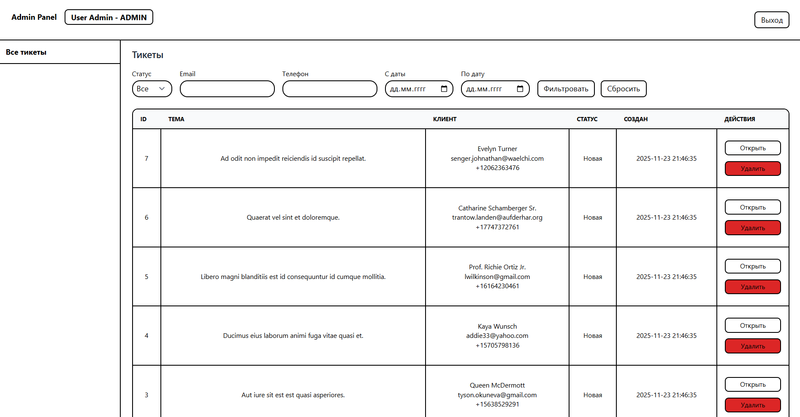
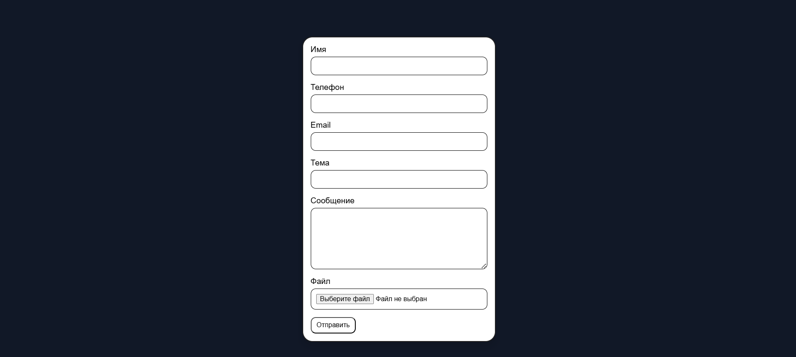

# Mini CRM - сбор и обработка заявок

Небольшая CRM для приема заявок через iframe и обработки менеджерами в админке.  
Проект написан на Laravel 12.

## Функциональность

### API
- `POST /api/tickets` - создание заявки
- `GET /api/tickets/statistics` - количество заявок за последний день, неделю и месяц

## Пример запроса API. POST на /api/tickets/ 
```
{
    "customer_phone":"+809590943721",
    "customer_email": "test1@ex.ua",
    "customer_name": "Test Name",
    "subject": "Test Subj",
    "text": "Test text"
}
```
## Пример ответа
```
{
    "data": {
        "id": 13,
        "subject": "Test Subj",
        "text": "Test text",
        "status": "new",
        "answered_at": null,
        "customer_id": 11,
        "customer_name": "Test Name",
        "customer_phone": "+809590943721",
        "customer_email": "test1@ex.ua",
        "file": [],
        "created_at": "2025-11-23 22:55:38",
        "updated_at": "2025-11-23 22:55:38"
    }
}
```

## Пример получения статистики. GET на /api/tickets/statistics

```
{
    "day": 13,
    "month": 13,
    "week": 13
}
```
так же возможна фильтрация с помощью параметра `/api/tickets/statistics?period=` и указание одного из значений `week`, `day`, `month`


### Виджет
- Страница /widget для встраивания через `<iframe>`
- Отправка формы через AJAX
- Вывод ошибок валидации
- Возможность прикреплять файлы

## Пример добавления виджета
```
<div style='display:flex;justify-content:center;'>
    <iframe src="http://mini-crm.test/widget" width="400" height="650" frameborder="0" scrolling="no" style="border:0; overflow:hidden;"
    ></iframe>
</div>
```

### Админка
Доступна только ролям **admin** и **manager**.
Аутентификация: `/login`

### Тестовые аккаунты

**Admin**
- Email: admin@test.com
- Пароль: admin

**Manager**
- Email: manager1@test.com
- Пароль: manager1

Реализовано:
- список заявок с пагинацией
- фильтры: статус, email, телефон, период (дата "от" и "до")
- просмотр заявки
- скачивание прикрепленного
- изменение статуса (если установлен done, сохраняется answered_at)
- удаление заявки доступно только роли **admin**

## Используемые технологии

- Laravel 12
- PHP 8.4
- Breeze
- TailwindCSS
- Spatie Permission
- Spatie MediaLibrary

## Установка

```bash
git clone https://github.com/LostSvan/mini-crm.git
cd mini-crm
composer install
npm install
npm run build
cp .env.example .env
php artisan key:generate
php artisan migrate --seed
```
## Запуск
```
php artisan serve
```
## Скриншот из админки


## Скриншот встроенного виджета

